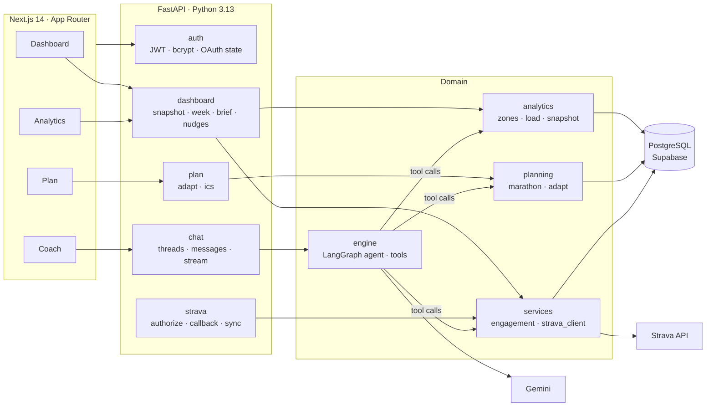
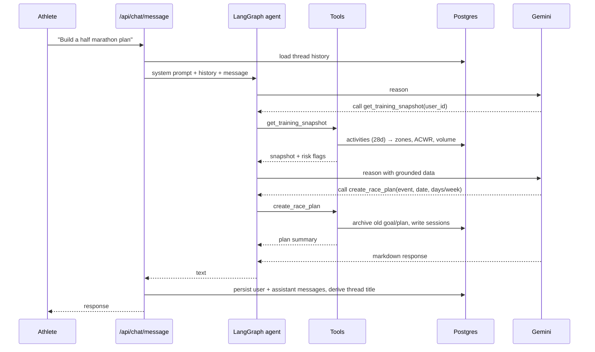

# ZoneTwo

An endurance coaching platform built on real Strava data. Deterministic analytics and a rule-based periodization engine drive the product surface; a tool-calling Gemini agent handles conversational coaching, grounded on the same database the dashboard reads.

           

---


## Overview

Most training apps are either a dashboard or a chatbot. Zone 2 Coach separates the two concerns deliberately:

- **Hot path (no LLM):** Strava sync → Postgres → SQL/Python analytics → dashboard, plan calendar, activity detail. Fast, deterministic, cheap.
- **Reasoning path (LLM with tools):** A LangGraph ReAct agent on Gemini that *must* call typed tools to read training snapshots, generate plans, or adapt them. It cannot invent mileage or heart-rate data; every number it cites comes from a tool response.

The result is a coach that says "your ACWR is 1.6 and volume jumped 18% — take an easy week" because the analytics layer computed it, not because the model guessed.

---


## Capabilities


| Area                         | What ships                                                                                                                                               |
| ---------------------------- | -------------------------------------------------------------------------------------------------------------------------------------------------------- |
| **Strava integration**       | OAuth 2 with HMAC-signed state, automatic token refresh, 12-month backfill, incremental sync, athlete profile import, 429/5xx backoff                    |
| **Training analytics**       | 28-day snapshots, weekly volume series, Karvonen HR zone distribution, TRIMP-style load, acute:chronic workload ratio, risk flags, data-quality coverage |
| **Periodization engine**     | Marathon/half plans (8–20 weeks) with base → build → peak → taper phasing, 10 % weekly ramp cap, HR-reserve targets per session type                     |
| **Plan adaptation**          | Structured intents — `injured`, `travel_week`, `move_long_run`, `race_moved_2_weeks`, `missed_week` — rewrite upcoming sessions in place                 |
| **Plan ↔ activity matching** | Completed Strava runs auto-mark planned sessions as `DONE` / `PARTIAL`; weekly adherence and `.ics` export                                               |
| **Coach agent**              | Threaded chat, five Pydantic tools, safety policy, model fallback chain with exponential backoff, SSE streaming endpoint                                 |
| **Engagement**               | Weekly brief, proactive nudges (stale sync, load spike, missing long run before race)                                                                    |
| **Web app**                  | Dashboard, analytics, plan calendar, coach, activity detail, settings; paginated lists; responsive shell with hero/paper backdrops                       |


---


## Architecture




### Coach grounding loop




**Agent tools** (`backend/app/engine/tools.py`)


| Tool                     | Purpose                                                                                               |
| ------------------------ | ----------------------------------------------------------------------------------------------------- |
| `get_training_snapshot`  | Volume, zones, ACWR, load series, sport mix, data quality, risk flags                                 |
| `get_weekly_coach_brief` | 7-day summary with plan adherence and days-to-race                                                    |
| `create_race_plan`       | Validates timeline (rejects marathons < 12 weeks out), archives prior goals, writes a periodized plan |
| `adapt_training_plan`    | Applies a structured intent to pending sessions                                                       |
| `get_strava_auth_link`   | Signed OAuth URL when the athlete isn't connected                                                     |


A safety policy in the system prompt forbids medical diagnosis, forbids citing numbers not returned by tools, and requires recovery-first advice when `acwr_elevated` or `volume_spike` flags are present.

---


## Analytics methodology


| Metric                 | Method                                                                                                                      | Where                    |
| ---------------------- | --------------------------------------------------------------------------------------------------------------------------- | ------------------------ |
| **HR zones (1–5)**     | Karvonen: `(HR − rest) / (max − rest)`; boundaries at 60 / 70 / 80 / 90 % of reserve. Distribution weighted by moving time. | `analytics/zones.py`     |
| **Session load**       | TRIMP proxy: `minutes × (avg HR / 100)`, falling back to duration when HR is absent                                         | `analytics/load.py`      |
| **ACWR**               | Latest week's load ÷ mean of trailing 4 weeks; `> 1.5` raises `acwr_elevated`                                               | `analytics/load.py`      |
| **Volume spike**       | Week-over-week load increase `> 15 %`                                                                                       | `analytics/snapshot.py`  |
| **Plan ramp**          | Weekly volume capped at `+10 %` through base/build; `+5 %` at peak; 70 % → 55 % taper                                       | `planning/marathon.py`   |
| **Session HR targets** | Easy/long 65–75 % HRR · tempo 78–85 % · intervals 88–95 %                                                                   | `planning/marathon.py`   |
| **Session matching**   | Same-day run ≥ 80 % of target distance → `DONE`; any distance → `PARTIAL`                                                   | `services/engagement.py` |


---


## API surface


| Group          | Endpoints                                                                                                                                                                                         |
| -------------- | ------------------------------------------------------------------------------------------------------------------------------------------------------------------------------------------------- |
| **Auth**       | `POST /api/auth/register` · `POST /api/auth/login` · `GET /api/auth/me` · `PATCH /api/auth/profile`                                                                                               |
| **Strava**     | `GET /api/strava/authorize` · `GET /api/strava/callback` · `POST /api/strava/sync`                                                                                                                |
| **Dashboard**  | `GET /api/dashboard` · `GET /api/today` · `GET /api/plan/week` · `GET /api/training/snapshot` · `GET /api/brief/weekly` · `GET /api/nudges` · `POST /api/sessions/{id}/status`                    |
| **Activities** | `GET /api/activities` · `GET /api/activities/training-log` · `GET /api/activities/{id}` (paginated)                                                                                               |
| **Plan**       | `POST /api/plan/adapt` · `GET /api/plan/ics`                                                                                                                                                      |
| **Chat**       | `POST/GET /api/chat/threads` · `DELETE /api/chat/threads/{id}` · `GET /api/chat/threads/{id}/messages` · `POST /api/chat/message` · `POST /api/chat/message/stream` · `GET /api/chat/export/{id}` |


All list endpoints return `{ items, page, page_size, total, total_pages, has_next, has_prev }`. Interactive docs at `/docs`.

---


## Engineering highlights


| Area                       | What to look at                                                                                                                                                                                     |
| -------------------------- | --------------------------------------------------------------------------------------------------------------------------------------------------------------------------------------------------- |
| **Upstream resilience**    | `services/strava_client.py` — 429 + `Retry-After`, 5xx backoff, 401 refresh · `engine/coach_agent.py` — `GEMINI_MODEL` → fallbacks, backoff, `CoachUnavailableError` → HTTP 503 in `routes/chat.py` |
| **OAuth binding**          | `auth.py` — HMAC-signed `state` (user id, nonce, 10‑min TTL)                                                                                                                                        |
| **Schema without Alembic** | `init_db.py` — `create_all` + targeted `ALTER` via `information_schema`; autocommit DDL; `DB_SKIP_STARTUP_MIGRATIONS`                                                                               |
| **Postgres pool**          | `db.py` — `pool_pre_ping`, recycle, keepalives, connect timeout                                                                                                                                     |
| **Dashboard BFF**          | `routes/dashboard.py` — `GET /api/dashboard` one payload; metric copy in `metric_glossary.py`                                                                                                       |
| **Chat UX**                | `services/chat_titles.py` — intent-based thread titles on first message                                                                                                                             |
| **Frontend shell**         | `components/scene/`, `lib/imagery.ts` + `npm run verify:imagery`, `lib/metricGlossary.ts` (API explainers override when present)                                                                    |


---


## Tech stack


| Layer              | Technologies                                                                                |
| ------------------ | ------------------------------------------------------------------------------------------- |
| **Backend**        | Python 3.13 · FastAPI · SQLAlchemy 2 · Pydantic v2 · Uvicorn · httpx                        |
| **Agent**          | LangGraph (`create_react_agent`) · LangChain Google GenAI · Gemini 2.x                      |
| **Data**           | PostgreSQL on Supabase · JSONB activity payloads · UUID keys                                |
| **Auth**           | JWT (python-jose) · bcrypt · HMAC-signed OAuth state                                        |
| **Frontend**       | Next.js 14 · React 18 · TypeScript · Tailwind CSS · Framer Motion · Recharts · lucide-react |
| **Infrastructure** | Docker · Render or Fly (API) · Vercel (web) · GitHub Actions (`ruff`, `next build`)         |


---


## Repository layout

```
ZoneTwo/
├── backend/
│   ├── app/
│   │   ├── analytics/      # zones, load, snapshot, volume
│   │   ├── engine/         # LangGraph agent + tools
│   │   ├── planning/       # marathon periodization, adapt intents
│   │   ├── routes/         # auth, strava, dashboard, activities, plan, chat
│   │   ├── services/       # strava_client, engagement, chat_titles
│   │   ├── auth.py · db.py · init_db.py · metric_glossary.py · models.py · pagination.py
│   │   └── main.py
│   ├── Dockerfile · fly.toml · requirements.txt · environment.yml
│   └── seed_db.py
├── frontend/
│   ├── app/                # (app)/home · training · plan · coach · activities/[id] · settings · login
│   ├── components/         # dashboard, plan, scene, motion, ui
│   ├── lib/                # api, auth, imagery, metricGlossary, coachFollowUps
│   └── scripts/            # verify-imagery
└── .github/workflows/ci.yml
```

---

Built by **Manojkumar**. Training data belongs to the athlete; nothing leaves the database except the Strava sync and Gemini prompts you explicitly trigger.